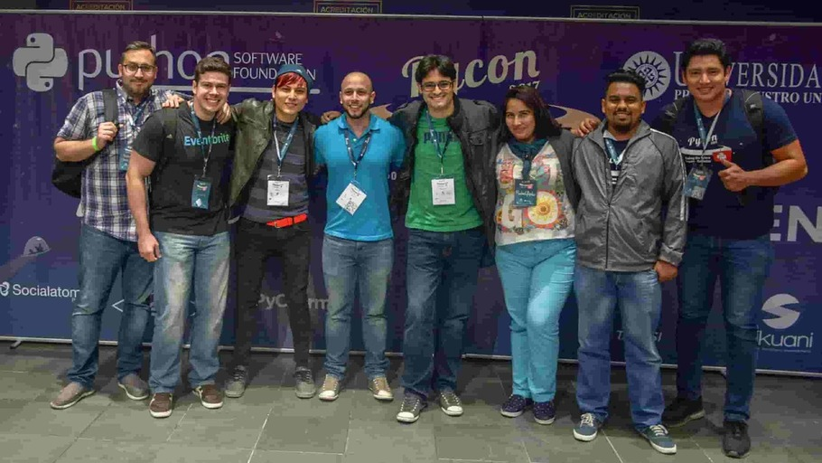
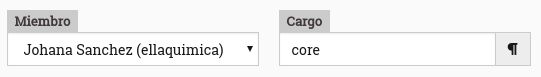
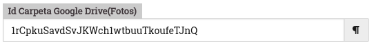

# Guía de Uso - Sitio Web de la Comunidad de Python Colombia

___

## Django Girls Colombia `/django-girls-colombia`

### Agregar Miembros

A petición del _Equipo Django Girls Colombia_, se modifica la vista para que la sección de `Equipo` se divida en dos apartados: `Core Team` y `Colaboradores`.

Al entrar a la vista `/admin` que proporciona _Lektor_, se observa en la sección de `Miembros`:

El valor agregado en el campo `Cargo`, define el apartado del Equipo en donde aparecerá el miembro:

* `core`: Core team
* `equipo`: colaboradores

## Eventos `/eventos`

### Eventos en `meetup.com`

Los scripts que se encargan de traer la información de los eventos de las comunidades locales:

* `/scripts/create_events.py`
* `/scripts/download_meetup_data.py`

Es necesario crear un archivo `MEETUP_API_KEY` para obtener la información.

> Pronto más información

### Eventos Django Girls

#### Galería de Fotos

Dentro del panel de creación de Eventos es requerido el campo `Id Carpeta Google Drive(Fotos)`

> Qué es un ID de carpeta (FOLDER-ID) y cómo obtenerlo

_Respuesta: Ir a Google Drive >> Abrir la carpeta >> Revisar la URL en el navegador_

Por ejemplo:

URL Carpeta: `https://drive.google.com/drive/folders/0B1iqp0kGPjWsNDg5NWFlZjEtN2IwZC00NmZiLWE3MjktYTE2ZjZjNTZiMDY2`

ID Carpeta:
`0B1iqp0kGPjWsNDg5NWFlZjEtN2IwZC00NmZiLWE3MjktYTE2ZjZjNTZiMDY2`
